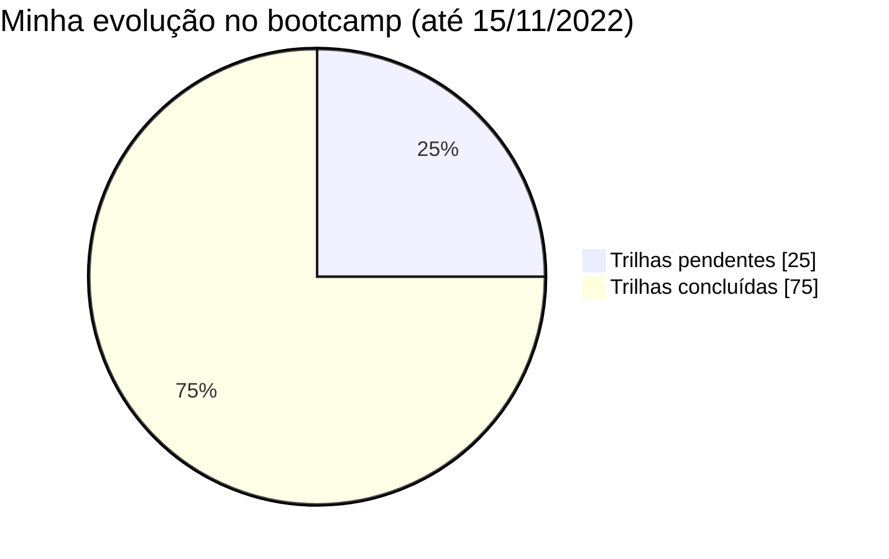

<h2>Bootcamp Java Begginers (2022)</h2>
<h3>•&nbsp; Desafio de Projeto 1 &nbsp;•</h3>

&nbsp;
&nbsp;

### :memo: Sobre este repositório
&nbsp;    
Diz respeito ao primeiro desafio passado no bootcamp chamado **[Java Beginners](https://www.dio.me/bootcamp/potencia-tech-powered-ifood-java-beginners)**, que está sendo promovido durante os meses de outubro e novembro de 2022 pela plataforma educacional Digital Innovation One (DIO), em parceria com o iFood/Potência Tech. 

O objetivo aqui é a criação de um diretório que vá contendo o planejamento e algumas notas que descrevam meu progresso até a finalização das trilhas (data prevista: 27/11/2022).

&nbsp; 

&nbsp;    
### :hourglass_flowing_sand:  A jornada até aqui
&nbsp;    

	<b>Trilha em andamento:</b> Programação Orientada a Objetos com Java

&nbsp;    
### :bookmark_tabs: Atividades
&nbsp;   
**Próximos cursos programados:**  
- [ ] Trabalhando com Collections Java
- [ ] Principais Protocolos de Comunicação da Internet
- [ ] Gerenciamento de Dependências e Build em Java com Maven

&nbsp; 

**Cursos já concluídos:**  
- [x] Introdução ao Desenvolvimento Moderno de Software 
- [x] Introdução à Programação e Pensamento Computacional 
- [x] Introdução ao Git e GitHub 
- [x] Introdução à Plataforma Java
- [x] Ambiente de Desenvolvimento Java
- [x] Aprendendo a Sintaxe Java
- [x] Lógica Condicional e Controle de Fluxos em Java
- [x] Estruturas de Repetição e Arrays em Java
- [x] Entendendo Métodos Java
- [x] Programação Orientada a Objetos
- [x] Debugging Java
- [x] Tratamento de Exceções em Java
- [x] Desafio de Projeto: Abstraindo um Bootcamp Usando a Orientação a Objetos
- [x] + Trilha: Fortalecendo sua Carreira Profissional
&nbsp; 

&nbsp;    
### :heavy_check_mark: Desafio(s) concluídos até o momento
&nbsp;   
  - Criando seu Primeiro Repositório no GitHub para Compartilhar seu Progresso no Bootcamp
  - Dominando Algoritmos Básicos com Desafios de Código Java  
  - Dominando Algoritmos Intermediários com Desafios de Código Java 
&nbsp; 

&nbsp;    
### :computer: Links úteis
&nbsp;   
- [Curso Introdutório Collections Java](https://github.com/cami-la/curso-dio-intro-collections) (da professora Camila Cavalcante)
- [Debugging Java](https://github.com/cami-la/debugging-java) (da professora Camila Cavalcante)
- [Desafio: Aprenda na Prática Programação Orientada a Objetos](https://github.com/cami-la/desafio-poo-dio) (da professora Camila Cavalcante)
- [Guia para desenvolvimento em Java](https://github.com/julianazanelatto/roadmap_java_repo) (da professora Juliana Mascarenhas)
- [Java Básico](https://glysns.gitbook.io/java-basico) (do professor Gleyson Sampaio)
- [Loops e Arrays](https://github.com/cami-la/loops-e-arrays) (da professora Camila Cavalcante)
- [Tratamento de Exceções em Java](https://github.com/cami-la/exceptions-java) (da professora Camila Cavalcante)