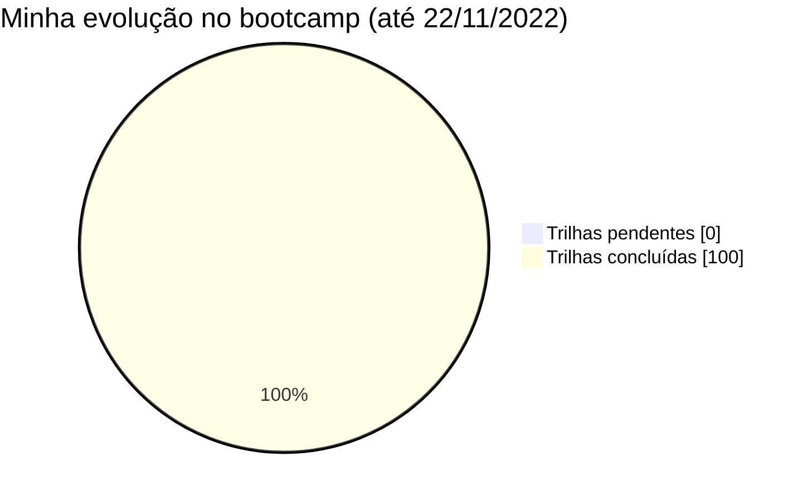

<h2>Bootcamp Java Beginners (2022)</h2>
<h3>•&nbsp; Desafio de Projeto 1 &nbsp;•</h3>

&nbsp;
&nbsp;

### Sobre este repositório
&nbsp;    
Diz respeito ao primeiro desafio passado no bootcamp Java Beginners, que foi promovido durante os meses de outubro e novembro de 2022 pela plataforma educacional Digital Innovation One (DIO), em parceria com o iFood/Potência Tech. 

O objetivo aqui é a criação do primeiro repositório referente ao bootcamp, para que contenha o planejamento e algumas obervações que descrevam meu progresso até a finalização das trilhas de estudo *(data prevista para o término: 27/11/2022)*.

&nbsp; 

&nbsp;      
### :hourglass_flowing_sand:  A jornada até aqui
&nbsp;    

	<b>Última trilha realizada:</b> Ganhando Produtividade com o Spring Framework

&nbsp;    
### :bookmark_tabs: Atividades
&nbsp;   
**Próximos cursos programados:**  
*(Todos os cursos realizados)*  
&nbsp; 

**Cursos concluídos:**  
- [x] Introdução ao Desenvolvimento Moderno de Software 
- [x] Introdução à Programação e Pensamento Computacional 
- [x] Introdução ao Git e GitHub 
- [x] Introdução à Plataforma Java
- [x] Ambiente de Desenvolvimento Java
- [x] Aprendendo a Sintaxe Java
- [x] Lógica Condicional e Controle de Fluxos em Java
- [x] Estruturas de Repetição e Arrays em Java
- [x] Entendendo Métodos Java
- [x] Programação Orientada a Objetos
- [x] Trabalhando com Collections Java
- [x] Debugging Java
- [x] Tratamento de Exceções em Java
- [x] Desafio de Projeto: Abstraindo um Bootcamp Usando a Orientação a Objetos
- [x] Principais Protocolos de Comunicação da Internet
- [x] Gerenciamento de Dependências e Build em Java com Maven
- [x] Imersão no Spring Framework com Spring Boot 
- [x] Criando uma API REST Documentada com Spring Web e Swagger
- [x] Desafio de Projeto: Explorando Padrões de Projeto na Prática com Java
- [x] + Trilha: Fortalecendo sua Carreira Profissional
&nbsp; 

&nbsp;    
### :heavy_check_mark: Desafio(s) concluídos
&nbsp;   
  - Criando seu Primeiro Repositório no GitHub para Compartilhar seu Progresso no Bootcamp [(link)](https://github.com/michelelozada/Bootcamp-DIO-Java-Beginners/tree/main/1-Desafios-de-Projeto/desafio-projeto-1)    
  - Aplicando Conceitos da OO com o Java, através da Abstração de um Domínio Chamado Bootcamp [(link)](https://github.com/michelelozada/Bootcamp-DIO-Java-Beginners/tree/main/1-Desafios-de-Projeto/desafio-projeto-2)    
  - Implementar com Java “puro” e com o framework Spring os padrões de projeto *Singleton*, *Strategy* e *Facade* [(link)](https://github.com/michelelozada/Bootcamp-DIO-Java-Beginners/tree/main/1-Desafios-de-Projeto/desafio-projeto-3)
  - Dominando Algoritmos Básicos com Desafios de Código Java [(link)](https://github.com/michelelozada/Bootcamp-DIO-Java-Beginners/tree/main/2-Desafios-de-Codigo-Basicos)      
  - Dominando Algoritmos Intermediários com Desafios de Código Java [(link)](https://github.com/michelelozada/Bootcamp-DIO-Java-Beginners/tree/main/3-Desafios-de-Codigo-Intermediarios)     
&nbsp; 

&nbsp;    
### :computer: Links úteis
&nbsp;   
- [Curso Introdutório Collections Java](https://github.com/cami-la/curso-dio-intro-collections) (da professora Camila Cavalcante)
- [Debugging Java](https://github.com/cami-la/debugging-java) (da professora Camila Cavalcante)
- [Desafio: Aprenda na Prática Programação Orientada a Objetos](https://github.com/cami-la/desafio-poo-dio) (da professora Camila Cavalcante)
- [Guia para desenvolvimento em Java](https://github.com/julianazanelatto/roadmap_java_repo) (da professora Juliana Mascarenhas)
- [Java Básico](https://glysns.gitbook.io/java-basico) (do professor Gleyson Sampaio)
- [Loops e Arrays](https://github.com/cami-la/loops-e-arrays) (da professora Camila Cavalcante)
- [Tratamento de Exceções em Java](https://github.com/cami-la/exceptions-java) (da professora Camila Cavalcante)
&nbsp;

&nbsp;    

<a href="https://github.com/michelelozada/Bootcamp-DIO-Java-Beginners">[Voltar à tela inicial do repositório]</a>

